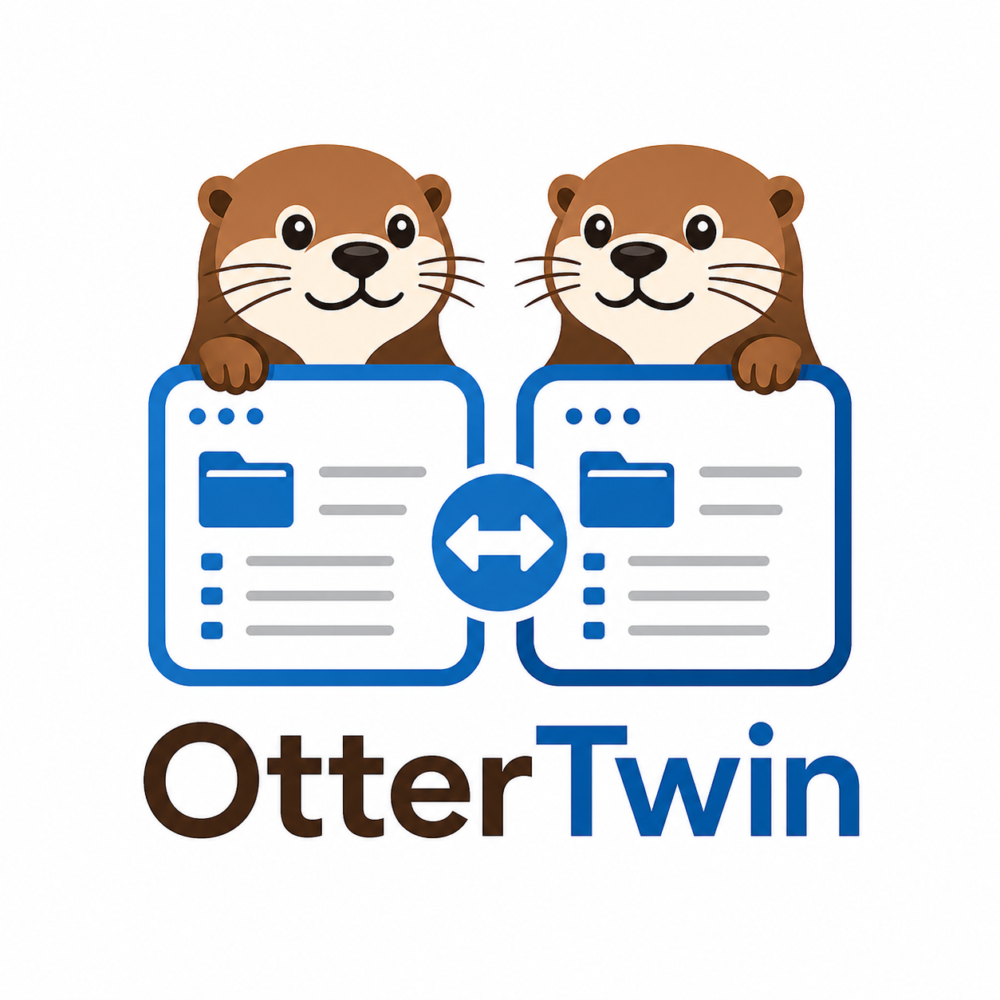

# Disclaimer

Hi everyone! As often happens, this app is the result of me looking for a free dual-pane file manager that looks good on macOS and, most importantly, supports integrity verification for copied files. I couldn’t find anything suitable, so I decided to try vibe-coding one myself — and at the same time test some “AI dark factory” scenarios.

So — **warning! — do not use this app yet!**  It is in a very early pre-pre-alpha version, and although you can run it, correct behavior and the advertised functionality are not guaranteed at all. Not yet.

<p align="center">
  
</p>

# OtterTwin

A macOS two-panel file manager designed for safe file transfers to NAS devices over SMB. Inspired by Total Commander.

## Features

- **Two-panel layout** — side-by-side directory browsing with keyboard navigation (Tab to switch panels, arrows to move, Enter to open, Backspace to go up)
- **SHA-256 verification** — checksum is computed inline during copy with zero extra I/O, then verified on the destination to guarantee data integrity
- **SMB support** — connect to network shares via the built-in SMB connect dialog; credentials saved to Keychain
- **Column sorting** — click Name, Size, or Modified headers to sort; directories always listed first
- **Quick-access bar** — one-click navigation to Home, Desktop, Documents, Downloads, and /Volumes
- **Breadcrumb navigation** — click any path component to jump there
- **F5 Copy / F6 Move / F8 Delete** — standard commander-style file operations with live progress

## Requirements

- macOS 14.0+
- Xcode 16+

## Build

The project file is generated from `project.yml` using [xcodegen](https://github.com/yonaskolb/XcodeGen):

```bash
brew install xcodegen
xcodegen generate
open OtterTwin.xcodeproj
```

For a command-line build (no code signing required):

```bash
xcodebuild -project OtterTwin.xcodeproj -scheme OtterTwin -configuration Debug \
  CODE_SIGN_IDENTITY="" CODE_SIGNING_REQUIRED=NO CODE_SIGNING_ALLOWED=NO \
  build
open build/Build/Products/Debug/OtterTwin.app
```

## Tests

```bash
xcodebuild test -project OtterTwin.xcodeproj -scheme OtterTwinTests \
  CODE_SIGN_IDENTITY="" CODE_SIGNING_REQUIRED=NO CODE_SIGNING_ALLOWED=NO
```
