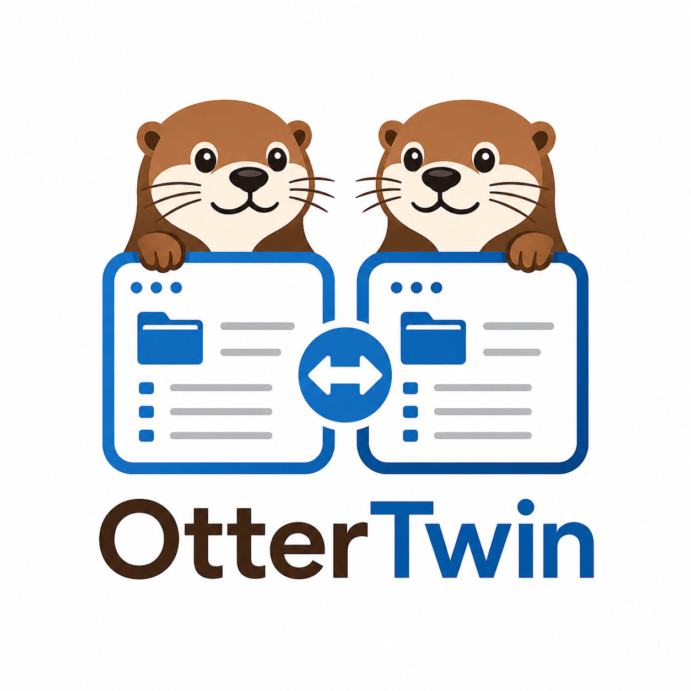

# Disclaimer

Hi everyone! As often happens, this app is the result of me looking for a free dual-pane file manager that looks good on macOS and, most importantly, supports integrity verification for copied files. I couldn’t find anything suitable, so I decided to try vibe-coding one myself — and at the same time test some “AI dark factory” scenarios.

So — **warning! — do not use this app yet!**  It is in a very early pre-pre-alpha version, and although you can run it, correct behavior and the advertised functionality are not guaranteed at all. Not yet.

<p align="center">
  
</p>

# OtterTwin

A macOS two-panel file manager designed for safe file transfers to NAS devices over SMB. Inspired by Total Commander.

## Features

- **Two-panel layout** — side-by-side directory browsing with keyboard navigation (Tab to switch panels, arrows to move, Enter to open, Backspace to go up)
- **SHA-256 verification** — checksum is computed inline during copy with zero extra I/O, then verified on the destination to guarantee data integrity
- **SMB support** — connect to network shares via the built-in SMB connect dialog; credentials saved to Keychain
- **Column sorting** — click Name, Size, or Modified headers to sort; directories always listed first
- **Quick-access bar** — one-click navigation to Home, Desktop, Documents, Downloads, and /Volumes
- **Breadcrumb navigation** — click any path component to jump there
- **F5 Copy / F6 Move / F8 Delete** — standard commander-style file operations with live progress

## Requirements

- macOS 14.0+
- Xcode 16.4 (the version CI uses)
- [XcodeGen](https://github.com/yonaskolb/XcodeGen) 2.42.0 (the version CI uses; CI also verifies the release archive's SHA-256)

## Install for personal use

OtterTwin is built for personal use and is not distributed through the App Store, so it runs
**without the App Sandbox** (it needs to reach your home folder and mounted network volumes
directly). It is ad-hoc signed with the Hardened Runtime; no Apple developer account is needed.

### From source (recommended)

With Xcode 16.4 and XcodeGen installed (`brew install xcodegen`):

```bash
scripts/install-local.sh            # build Release and install to /Applications
scripts/install-local.sh --dry-run  # only print what it would do
```

The script generates the Xcode project, builds a Release app signed ad hoc
(`CODE_SIGN_IDENTITY=-`), verifies the signature and installs it as `/Applications/OtterTwin.app`.
An existing install is kept as `/Applications/OtterTwin (previous).app` (replacing an older
"previous"), so you can always go back one build. It prints the version and git commit it
installed, and can be run as often as you like.

**Settings → About this build** shows the commit SHA and build date of the running app.
Builds made directly in Xcode show "unknown".

### From a CI build

Every push to `main` produces an `OtterTwin-<sha>.zip` artifact on the *macOS CI* workflow run
(kept for 14 days). Unzip it, move `OtterTwin.app` to `/Applications`, then remove the download
quarantine flag (the app is not notarized, so Gatekeeper would otherwise refuse to open it):

```bash
xattr -dr com.apple.quarantine /Applications/OtterTwin.app
```

### Permission prompts to expect

Because the app is not sandboxed, macOS privacy protection (TCC) asks the first time OtterTwin
opens a protected location. Click **Allow**:

- **Desktop, Documents and Downloads folders** — one prompt per folder;
- **Network Volumes** — when you open an SMB share under `/Volumes`;
- **Removable Volumes** — when you open a USB/external disk;
- **Keychain** — when a saved SMB password is read after the app was rebuilt (each ad-hoc build
  has a new signature); choose *Always Allow*.

Optional: to browse every location without per-folder prompts, add OtterTwin under
**System Settings → Privacy & Security → Full Disk Access**. A rebuilt app may need to be
re-added there.

## Build

`OtterTwin.xcodeproj` is **not** tracked in git: it is generated from `project.yml`.
Only `OtterTwin.xcodeproj/project.xcworkspace/xcshareddata/swiftpm/Package.resolved`
is committed, so Swift package versions are reproducible. Regenerate the project after
pulling or after adding/removing source files:

```bash
brew install xcodegen   # make sure `xcodegen --version` prints 2.42.0
xcodegen generate
open OtterTwin.xcodeproj
```

For a command-line build (no code signing required):

```bash
xcodebuild -project OtterTwin.xcodeproj -scheme OtterTwin -configuration Debug \
  -derivedDataPath build \
  CODE_SIGN_IDENTITY="" CODE_SIGNING_REQUIRED=NO CODE_SIGNING_ALLOWED=NO \
  build
open build/Build/Products/Debug/OtterTwin.app
```

## Tests

Unit and snapshot tests (equivalent to the CI `build-and-test` job; `TEST_RUNNER_SNAPSHOT_TESTING_RECORD=never`
makes a missing or different snapshot fail instead of being recorded):

```bash
xcodegen generate
TEST_RUNNER_SNAPSHOT_TESTING_RECORD=never \
xcodebuild test -project OtterTwin.xcodeproj -scheme OtterTwinTests \
  -destination 'platform=macOS' -disableAutomaticPackageResolution \
  CODE_SIGN_IDENTITY="" CODE_SIGNING_REQUIRED=NO CODE_SIGNING_ALLOWED=NO
```

Snapshot baselines are recorded on the CI runner (macos-15, @1x, default accent colour), so the
snapshot tests **always fail on a Retina Mac** (@2x). CI is the only reference; do not re-record
baselines locally.

### Continuous integration

`.github/workflows/macos-ci.yml` runs on every pull request, every push to `main`, pushes to
`ci/record-snapshots/**` branches and manual *Run workflow* (`macos-15` runner, Xcode 16.4,
XcodeGen 2.42.0):

- **`build-and-test`** (the check merges are gated on): generates the project, resolves packages strictly from
  `Package.resolved`, builds without signing secrets and runs `OtterTwinTests` (unit +
  snapshot tests). Snapshot recording is disabled, so a missing or different baseline fails
  the check. On failure the `.xcresult` bundle and the full log are uploaded as artifacts.
- **`ui-tests`** (non-blocking): runs the XCUITest suite and always uploads its results.
  It is informational only and is **not** counted as verified coverage.
- **`release-build`** (also required): lints `scripts/install-local.sh` with `shellcheck`, runs its
  `--dry-run`, then uses it to build and install a Release app (ad-hoc signed) twice into a temp
  folder, and checks `codesign --verify --deep --strict`, the Hardened Runtime, that the app has
  no sandbox/keychain-group entitlements and that the build SHA is stamped. On pushes to `main`
  it uploads the app as the `OtterTwin-<sha>.zip` artifact (14 days).
- **`record-snapshots`**: records snapshot baselines on the CI runner. Triggered manually
  (*Run workflow* with "record snapshots" checked → artifact only) or by pushing a branch named
  `ci/record-snapshots/<name>` (the job commits the recorded images back to that branch only).
  Baselines never reach `main` except through a dedicated PR with before/after images.

Not covered by CI: real SMB/NAS transfers (need a real server), the macOS privacy prompts and
Keychain access of the installed app, and anything that needs the owner's machine. These are validated manually through the gate issues.
